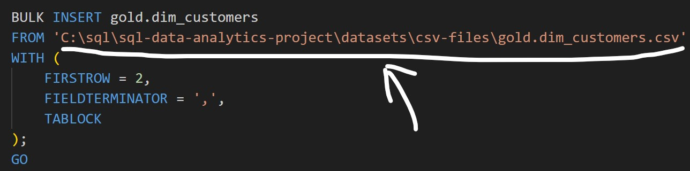

# Project : Sales Data Warehouse Analytics

A comprehensive collection of SQL scripts for data exploration, analytics, and reporting. These scripts cover various analyses such as database exploration, measures and metrics, time-based trends, cumulative analytics, segmentation, and more.
This repository contains SQL queries designed to quickly explore, segment, and analyze data within a relational database [ Called Sales Data Warehouse for a fictional company called Adventure Works]. Each script focuses on a specific analytical theme and demonstrates best practices for SQL queries.

## SQL Scripts Execution

To execute the SQL scripts in this repository, follow these steps:

1. **Set Up Your Environment**: Ensure you have installed SQL Server and SQL Server Management Studio. If you are using a different database system, ensure that the SQL syntax is compatible or adjust accordingly. For initiating the database, you can use the script called "00_init_database.sql" and make sure to change the respective source path of the datasets in this project repo to match your local environment or system.
   Change the Path Applicable as per the below:

2. **Connect to the Database**: Use your preferred database client or command-line tool to connect to the Sales Data Warehouse database. I have used SQL Server Management Studio (SSMS) for this project.

3. **Run the Scripts**: Copy and paste the SQL code from the desired script file into your SQL client and execute it. Review the results and make any necessary adjustments to the queries based on your specific data and analysis needs.

4. **Explore and Analyze**: Use the results of the queries to gain insights into the sales data, identify trends, and support decision-making processes.

## Analysis Content:

Each SQL script in this repository is categorized by its analytical focus. Below is a brief overview of the types of analyses included:

  

- **Database Initialisation**:  
 
  Initial exploration of the database structure, including tables, columns, and relationships.

  

- **Database Exploration**:  
 
  Initial exploration of the database structure, including tables, columns, and relationships.      
  - What are the key tables in the database?
  - What are the relationships between these tables?
  - What are the primary keys and foreign keys?

  

 
- **Dimensions Exploration**:  
 
  Calculation of key performance indicators (KPIs) and metrics to
  - Retrieve a list of unique countries from which customers originate
  - Retrieve a list of unique categories, subcategories, and products
- **Date Range Exploration**:  
 
  Analysis of sales data over specific time periods to identify trends and patterns.
  - Determine the first and last order date and the total duration in months  
  - Find the youngest and oldest customer based on birthdate

  

- **Measures Exploration (Key Metrics)**:  
   
  To calculate aggregated metrics (e.g., totals, averages) for quick insights.To identify overall trends or spot anomalies.

  - Find the Total Sales
  - Find how many items are sold
  - Find the average selling price
  - Find the Total number of Orders
  - Find the total number of products
  - Find the total number of customers
  - Find the total number of customers that has placed an order
  - Generate a Report that shows all key metrics of the business

  

  
- **Magnitude Analysis**:  
 
  To quantify data and group results by specific dimensions. Understanding data distribution across categories.

  - Find total customers by countries
  - Find total customers by gender
  - Find total products by category
  - What is the average costs in each category?
  - What is the total revenue generated for each category?
  - What is the total revenue generated by each customer?
  - What is the distribution of sold items across countries?

  

- **Ranking Analysis**:  
 
  To rank items (e.g., products, customers) based on performance or other metrics.
  To identify top performers or laggards.

  - Which 5 products Generating the Highest Revenue?
  - Ranking Using Window Functions
  - Find out what are the 5 worst-performing products in terms of sales?
  - Find out the top 10 customers who have generated the highest revenue
  - The 3 customers with the fewest orders placed

  

- **Change Over Time Analysis**:  
 
  To track trends, growth, and changes in key metrics over time. 
  For time-series analysis and identifying seasonality. 
  To measure growth or decline over specific periods.

  - Analyse sales performance over time using date functions like DateTrunc(), Year(), Month(), Format()

  

- **Cumulative Analysis**:  
 
  To calculate running totals or moving averages for key metrics. 
  To track performance over time cumulatively. 
  Useful for growth analysis or identifying long-term trends.

  - Calculate the total sales per month and the running total of sales over time

  

- **Performance Analysis (Year-over-Year, Month-over-Month) [YOY,MOM]**:  
 
  To measure the performance of products, customers, or regions over time. 
  For benchmarking and identifying high-performing entities. 
  To track yearly trends and growth.

  - Analyze the yearly performance of products by comparing their sales to both the average sales performance of the product and the previous year's sales

  

- **Data Segmentation Analysis**:  
   
  To group data into meaningful categories for targeted insights. 
  For customer segmentation, product categorization, or regional analysis.

  - Segment products into cost ranges and count how many products fall into each segment
  - Group customers into three segments based on their spending behavior:  
   And find the total number of customers by each group 
  	- **VIP**: Customers with at least 12 months of history and spending more than €5,000.
  	- **Regular**: Customers with at least 12 months of history but spending €5,000 or less.
  	- **New**: Customers with a lifespan less than 12 months. 
 
   

- **Part-to-Whole Analysis**:  
   
  To compare performance or metrics across dimensions or time periods. 
  To evaluate differences between categories. 
  Useful for A/B testing or regional comparisons. 

  - Which categories contribute the most to overall sales?  
  
- **Building Product Report**: 
   
  This Product Report consolidates key product metrics and behaviors.  
  Report Specifications and Acceptance Criteria Include:  
    1. Gathers essential fields such as product name, category, subcategory, and cost. 
    2. Segments products by revenue to identify High-Performers, Mid-Range, or Low-Performers.  
    3. Aggregates product-level metrics:
       - total orders
       - total sales
       - total quantity sold
       - total customers (unique)
       - lifespan (in months) 
    4. Calculates valuable KPIs:
       - recency (months since last sale)
       - average order revenue (AOR)
       - average monthly revenue 
 
  
Report Query is built through a series of CTEs (Common Table Expressions) to ensure clarity and maintainability. 
 
**Base Query**: Retrieves core columns from fact_sales and dim_products 
**Product Aggregations**: Summarizes key metrics at the product level 
**Final Query**: Combines all product results into one output 
 
The final output is a comprehensive view of product performance, enabling informed decision-making and strategic planning.

-------------------------## End Of Analysis Content ##----------------------------